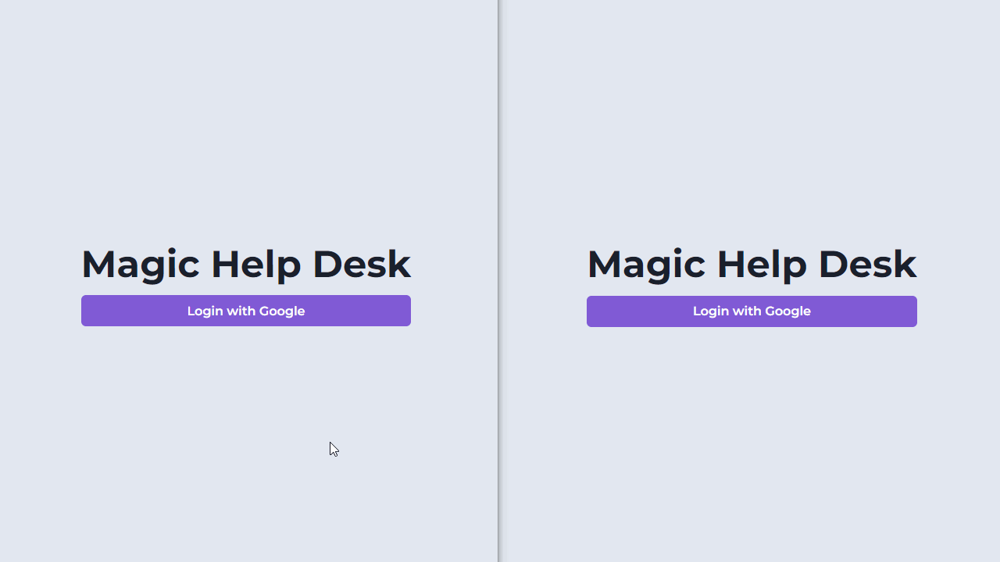

# Magic Help Desk

Um sistema de help desk, onde o usuário pode realizar o login, abrir, editar e excluir um chamado, e o admin pode responder e excluir. Aplicação feita com NextJS, Chakra UI para estilização, Firebase como ferramenta de autenticação e MongoDB junto com Mongoose para o gerenciamento do banco de dados.

## ✨ Preview

## 🛠 Builded with

##  About me

- 👤 Bacharel em jornalismo se aventurando pelo mundo da programação, estudando stacks relacionadas ao front-end, focado em ReactJS

- 🔭 Me encontre:  
